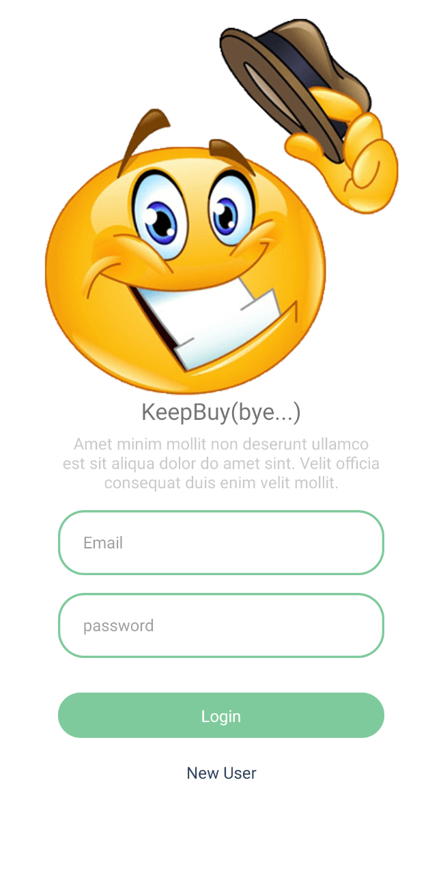
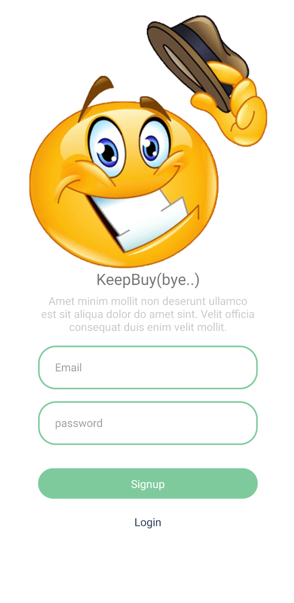
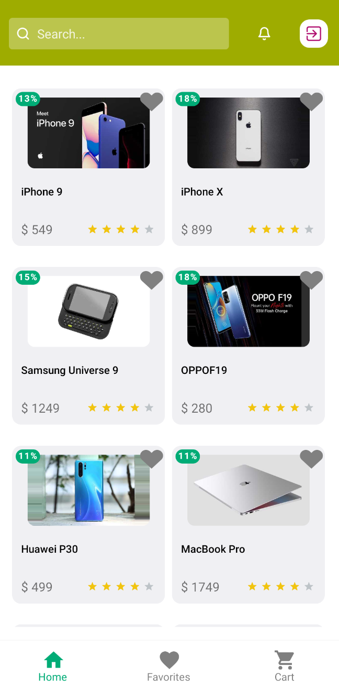
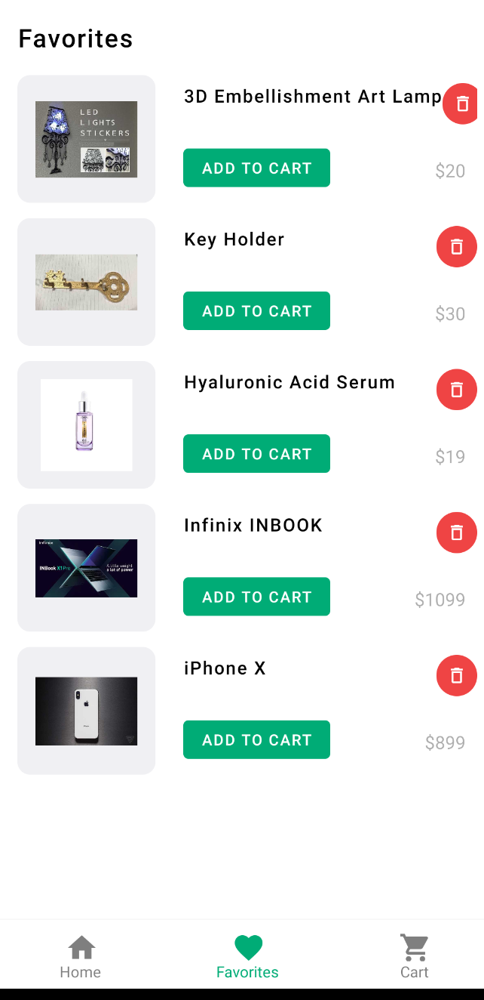
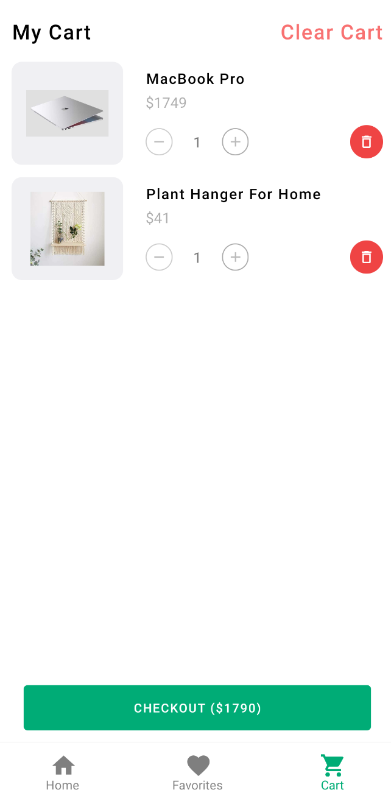
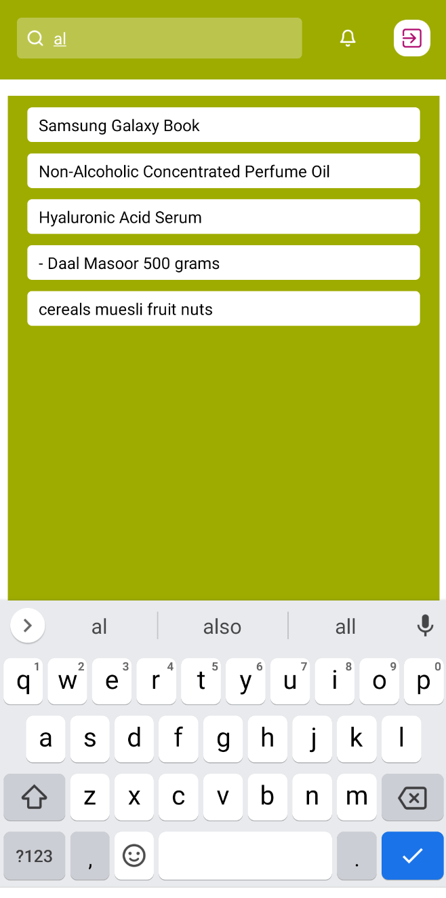

### KEEPBUY

<br />
<div align="center">
      
</div>

### About The Project

<p> This is an e-commerce site. You can login to the site by registering a user. You can add the product you want to your cart, buy it or add it to your favorites cart.</p>

### Installation

Get a free API at

```
https://dummyjson.com/
```

If you want to clone the repo

```
git@github.com:EmineCaki/keepbuy.git
```

Install NPM packages

```
npm install
```

In the project directory you can run

```
npx react-native run-android
npx react-native run-ios
```

### DEPENDENCİES

- @react-native-firebase/app
- redux
- redux-thunk
- @react-navigation
- moment
- react-hook-form
- react-native-ratings
- eact-native-vector-icons
- react-native-toast-message

<table class="image-table">

<tr>
<td>

</td>
<td>

</td>
<td>

</td>
</tr>
<tr>
<td>

</td>
<td>

</td>
<td>

</td>
</tr>

</table>
